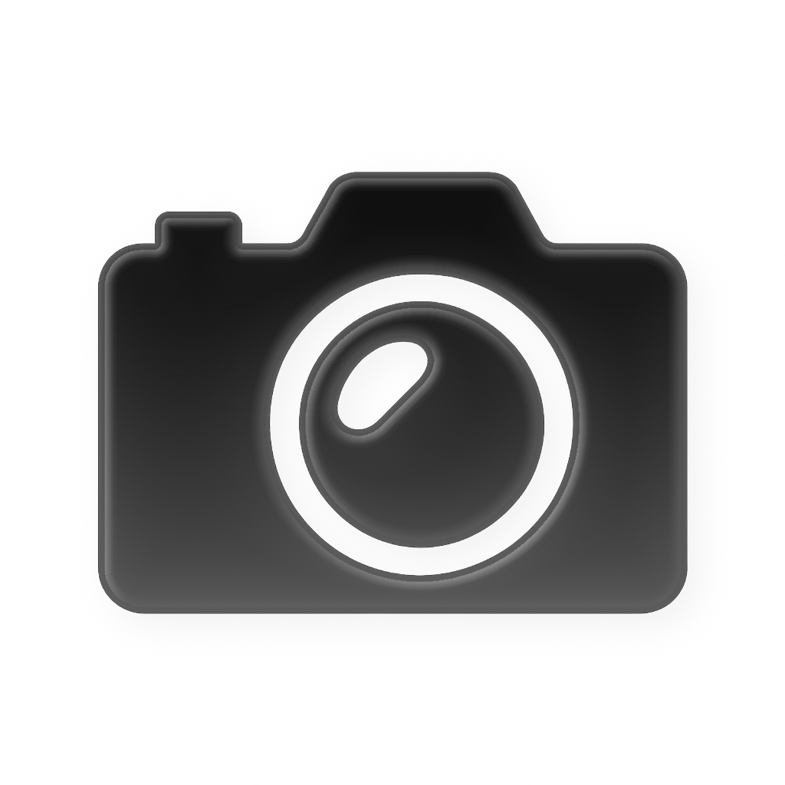
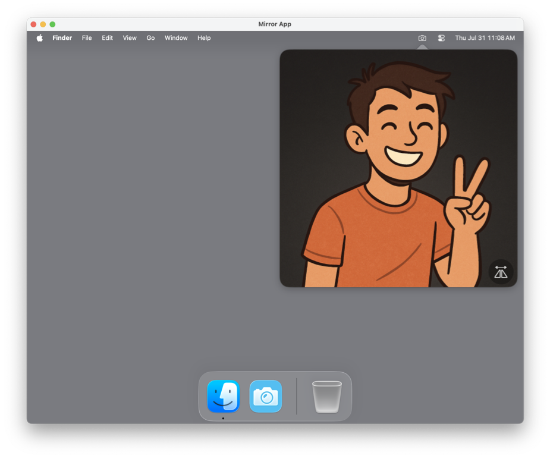

<div align="center">

<picture>
  <source srcset="Documentation/icon-dark.png" media="(prefers-color-scheme: dark)">
  <source srcset="Documentation/icon-light.png" media="(prefers-color-scheme: light)">
  
</picture>
<br/><br/>

**Mirror** is a lightweight macOS app that lives in your menu bar and gives you a quick, private webcam preview — perfect for checking your hair, lighting, or surroundings before hopping into a meeting.

</div>

## 🖥️ Screenshots 

<p align="center">
    
</p>

## ✨ Features

- 🖥️ **Live Webcam Preview**: Click the menu bar icon to instantly open a live video feed from your webcam.
- 🔄 **Flip Camera Option**: Mirror the video horizontally for a more natural view.
- 🎥 **Camera Selection**: Right-click the menu bar icon to switch between available video devices.
- 🚀 **Launch at Login**: Right-click the menu bar icon to enable automatically opening the app on logon. 
- 🎨 **macOS 26 Ready**: Fully supports macOS 26 with custom high-resolution app icons for light/dark/clear mode. 
---

## 🛠 Installation

Grab it from the Releases page, unzip & run or drop into /Applications.
It's signed and notarized!


## 🛠 DIY

Clone the repo and build with Xcode:

```bash
git clone https://github.com/gbabichev/Mirror.git
cd Mirror
open Mirror.xcodeproj
```

## 📝 Changelog

### 1.1.2
- Updated app icon & readme.

### 1.1.1
- Improved camera preview startup. 
- Improved camera selection menu logic.

### 1.1
- Fixed right-click target — it's now easier to right-click and select a camera.
- Added support for USB cameras.
- Suspended cameras are now grayed out.
- Added a button to close the preview, instead of automatically closing on any other click. This lets you play with filters and other camera settings in the native macOS setting editor. 
- Signed and notarized! The app won't expire after a few days anymore 😊

### 1.0
- Initial release.

## 📄 License

MIT — free for personal and commercial use. 

## Privacy
<a href="Documentation/PrivacyPolicy.html">Privacy Policy</a>

## Support 
<a href="Documentation/Support.html">Support</a>