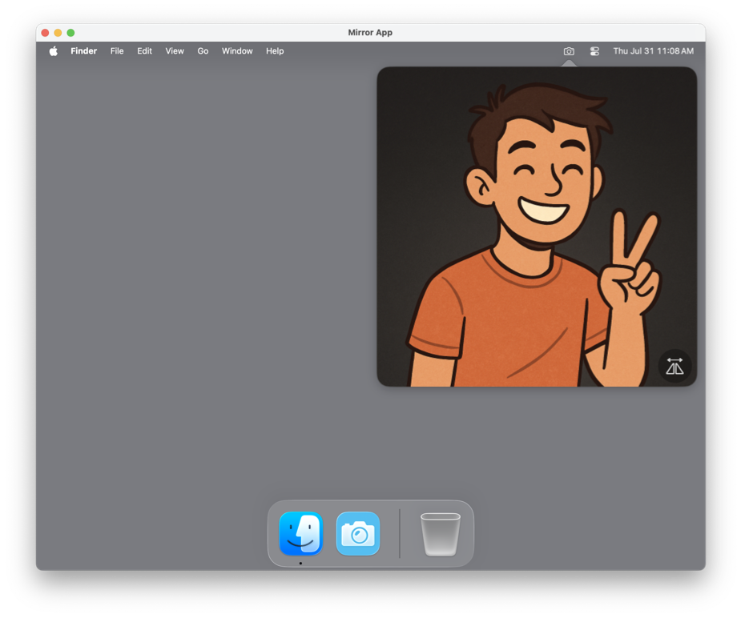
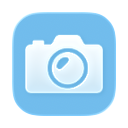
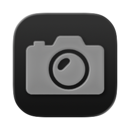

# 📷 Mirror

**Mirror** is a lightweight macOS app that lives in your menu bar and gives you a quick, private webcam preview — perfect for checking your hair, lighting, or surroundings before hopping into a meeting.

---

## ✨ Features

- 🖥️ **Live Webcam Preview**: Click the menu bar icon to instantly open a live video feed from your webcam.
- 🔄 **Flip Camera Option**: Mirror the video horizontally for a more natural view.
- 🎥 **Camera Selection**: Right-click the menu bar icon to switch between available video devices.
- 🚀 **Launch at Login**: Right-click the menu bar icon to enable automatically opening the app on logon. 
- 🎨 **macOS 26 Ready**: Fully supports macOS 26 with custom high-resolution app icons for light/dark/clear mode. 
---

## 📸 Screenshots

Light Mode with macOS 26 icon support.
<br>
<p align="center">

<br>



</p>
<br>


---

## 🛠 Installation

Grab it from the Releases page, unzip & run or drop into /Applications. 

Clone the repo and build with Xcode:

```bash
git clone https://github.com/gbabichev/Mirror.git
cd Mirror
open Mirror.xcodeproj
```

## 📄 License

MIT — free for personal and commercial use. 
